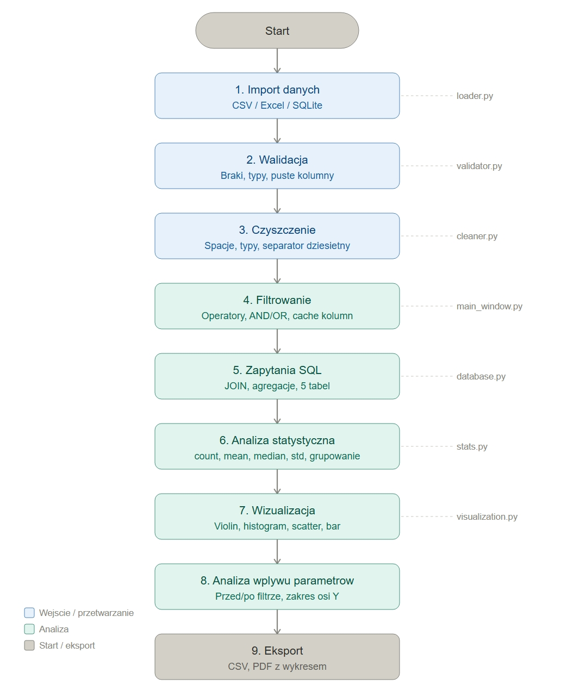

# Analizator danych pacjentów

Aplikacja desktopowa w Pythonie (PyQt5) do analizy relacyjnych danych medycznych. Realizuje pełny pipeline analizy danych — od importu i walidacji, przez filtrowanie i zapytania SQL, aż po wizualizację i raport końcowy.

## Diagram przepływu danych



## Funkcjonalności

- wczytywanie danych: CSV, Excel, baza SQLite (5 tabel relacyjnych)
- walidacja i czyszczenie danych
- filtrowanie z operatorami =, >, <, >=, <=, zawiera / nie zawiera, logika AND / OR
- zapytania SQL z JOIN między tabelami (patients, medications, outcomes, diagnoses, lab_results)
- analiza statystyczna: count, mean, median, min, max, std, grupowanie
- wizualizacja: violin plot, histogram, bar chart, scatter plot, wykres liniowy
- analiza wpływu parametrów filtrowania na wyniki
- eksport do CSV i PDF z wykresem

## Pipeline przetwarzania danych

1. Import — CSV / Excel / SQLite
2. Walidacja — braki danych, puste kolumny, typy
3. Czyszczenie — spacje, separatory dziesiętne, formaty
4. Filtrowanie — operatory numeryczne i tekstowe, AND / OR
5. Zapytania SQL — JOIN między 5 tabelami, agregacje
6. Analiza statystyczna — metryki dla kolumn numerycznych i tekstowych
7. Wizualizacja — automatyczny dobór typu wykresu według typów danych
8. Analiza wpływu parametrów — porównanie przed/po filtrze
9. Eksport — CSV, PDF z wykresem i statystykami

## Schemat bazy danych

Baza SQLite zawiera 5 tabel połączonych przez `patient_id`:

- `patients` — dane demograficzne i kliniczne (100 000 pacjentów)
- `medications` — leki i recepty (364 174 rekordów)
- `outcomes` — hospitalizacje i wyniki leczenia (11 001 rekordów)
- `diagnoses` — wizyty z kodami ICD-10 (274 592 rekordów)
- `lab_results` — wyniki badań laboratoryjnych (2 827 722 rekordów)

Aby wygenerować bazę danych z plików CSV:
```bash
python csv_to_sqlite.py --input_dir ./dane --output baza_pacjentow.db
```

## Struktura projektu
analizator.py/
├── ui/                  # interfejs użytkownika (PyQt5)
├── data/                # loader, validator, cleaner, database
├── analysis/            # stats, visualization
├── export/              # eksport raportów
├── docs/                # diagram pipeline
├── csv_to_sqlite.py     # konwersja CSV → SQLite
└── main.py              # punkt startowy
## Technologie

| Technologia | Zastosowanie |
|---|---|
| Python 3.9+ | język główny |
| PyQt5 | interfejs graficzny |
| pandas | przetwarzanie danych |
| matplotlib | wizualizacja |
| SQLite | baza danych relacyjna |
| reportlab | generowanie PDF |

## Uruchomienie
```bash
pip install pandas matplotlib pyqt5 reportlab openpyxl
python main.py
```

Projekt wykonany jako aplikacja egzaminacyjna z analizy danych medycznych.
